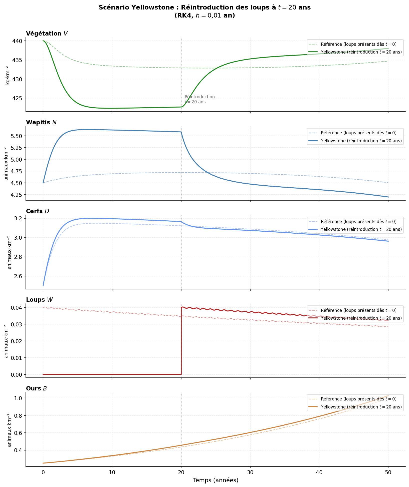
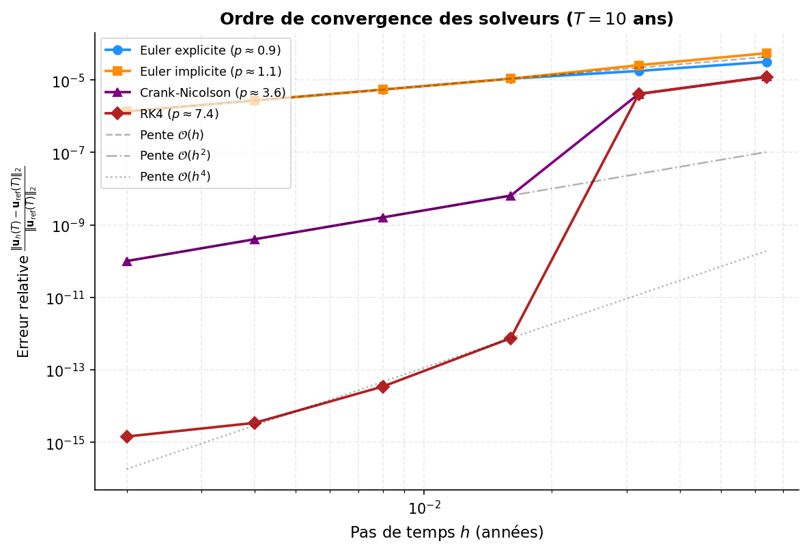

# 🐺 ProjetAN: Trophic Cascade Simulation

[](https://github.com/evrardlecureur/ProjetAN/actions/workflows/ci.yml)
[](https://github.com/evrardlecureur/ProjetAN/actions/workflows/codeql.yml)
[](https://github.com/evrardlecureur/ProjetAN/releases)
[](LICENSE)


What happens to the vegetation, the deer and the bears of a park when wolves come back?

This project models an ecosystem with **five populations** (vegetation, elk and moose, deer, wolves, bears) as a system of **five coupled nonlinear ODEs** and solves it numerically with four methods written from scratch in Python: explicit Euler, implicit Euler, Crank-Nicolson and RK4. A **Yellowstone scenario** reintroduces the wolves after twenty years without them, and a convergence study measures the empirical order of each method on this stiff system.

| Context | Authors | Instructors |
| --- | --- | --- |
| Numerical analysis project (MAM3), April to May 2026, Polytech Nice Sophia (Université Côte d'Azur) | Evrard Lecureur, Romain Ben, Thibaud Crotta, Zouhair Saitout | C. Boulbe, V. Vadez |

## 📸 Preview

| Yellowstone: the wolves reintroduced at t = 20 years (solid) against wolves present from the start (dashed) | Relative error at T = 10 years against the step size, one line per solver |
| --- | --- |
|  |  |

## 🧮 The Model

The state is `u = [V, N, D, W, B]` (vegetation biomass, elk, deer, wolves, bears per km²), with the parameters of the subject (`code/params.py`) and the equations in `code/model.py`:

- **vegetation**: logistic growth minus the grazing of the three herbivores (Michaelis-Menten terms);
- **elk and deer**: theta-logistic growth with a carrying capacity that depends on the available vegetation (Monod form), minus the predation of wolves and bears (Holling terms) and a natural mortality;
- **wolves**: a logarithmic numerical response to the total kill rate (Vucetich, 2011), natural mortality and a seasonal hunting term in `sin²(πt)`;
- **bears**: omnivores, they gain from the ungulates they catch and from the vegetation.

## 🔢 The Solvers

All four solvers share the signature `solver(F, u0, t0, tf, h)` and return the time grid and the trajectory (`code/solvers.py`):

| Method | Order | Stability | Implementation |
| --- | --- | --- | --- |
| Explicit Euler | 1 | conditional, small steps needed on this stiff system | one evaluation of `F` per step |
| Implicit Euler | 1 | A-stable | Newton-Raphson at each step, Jacobian by centred finite differences, explicit Euler as predictor |
| Crank-Nicolson | 2 | A-stable | same Newton solver on the trapezoidal equation |
| RK4 | 4 | conditional | classical four-stage scheme, used as the reference |

`code/main.py` runs three studies and writes five figures: the reference simulation over 50 years and the comparison of the solvers, the Yellowstone scenario with the phase portraits elk-wolves and deer-wolves, and the convergence study (relative error at the final time against `h` on a log-log plot, the slope fitted by least squares giving the empirical order). The empirical orders are printed at the end of the run and published in the summary of the CI.

## 🚀 Getting Started

Requires Python 3.12 and [Tectonic](https://tectonic-typesetting.github.io/) for the report.

```bash
git clone https://github.com/evrardlecureur/ProjetAN.git
cd ProjetAN
python -m venv .venv
source .venv/bin/activate          # Windows: .venv\Scripts\activate
pip install -r requirements.txt

cd code
python main.py                     # about 30 s, writes fig1 to fig5 next to the scripts
```

Build the report from the repository root:

```bash
tectonic -X compile Rapport.tex    # writes Rapport.pdf
```

The compiled report and the slides are in `docs/` and attached to each [release](https://github.com/evrardlecureur/ProjetAN/releases).

## 📁 Repository Structure

```text
ProjetAN/
├── code/
│   ├── params.py            # parameters of the model and initial conditions (table of the subject)
│   ├── model.py             # F(t, u): the five equations
│   ├── solvers.py           # explicit Euler, implicit Euler, RK4, Crank-Nicolson, Newton-Raphson
│   └── main.py              # reference run, comparison of the solvers, Yellowstone, convergence
├── figures/                 # the five figures used by the report, and the school logo
├── docs/
│   ├── sujet.pdf            # subject of the project
│   ├── rapport.pdf          # compiled report (French)
│   ├── slides.pdf           # slides of the defence (and slides.pptx)
│   └── script-soutenance.md # talk script (French)
├── Rapport.tex              # report source
├── requirements.txt         # pinned dependencies (requirements-dev.txt adds Ruff)
├── pyproject.toml           # Ruff configuration
├── .github/                 # CI, CodeQL, Dependabot, issue forms, pull request template
├── CITATION.cff             # citation metadata
└── CHANGELOG.md             # history of the versions
```

## ✅ Quality

- **CI** (`.github/workflows/ci.yml`): Ruff, the simulations run end to end with the empirical orders published in the job summary and the figures uploaded as an artifact, the report built with Tectonic, the Markdown files checked with markdownlint and lychee.
- **CodeQL** on Python and the workflows, **Dependabot** for the Python dependencies and the GitHub Actions.

## 👥 Authors

| Member | Part |
| --- | --- |
| Evrard Lecureur | Coordination, introduction, conclusion and annex of the report |
| Romain Ben | Architecture of the code, equations and parameters, explicit Euler |
| Thibaud Crotta | Implicit Euler, Crank-Nicolson and Newton-Raphson, justification of the methods |
| Zouhair Saitout | Yellowstone scenario, figures, analysis of the results, slides |

## 📄 License

This project is licensed under the [MIT License](LICENSE). The subject (`docs/sujet.pdf`) belongs to the course.
